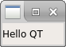
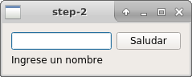
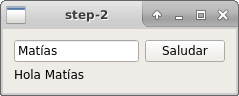
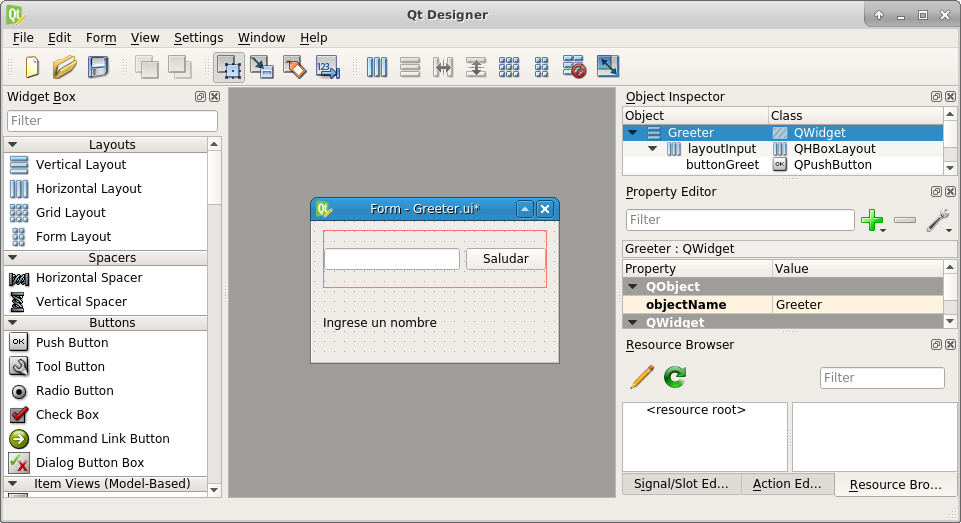

# GUIs

Introducción a la programación de interfaces gráficas

---

## Comparación de frameworks

Biblioteca | GTK | wxWidgets | Qt
---|---|---|---
Tipo de biblioteca | Framework gráfico | Framework gráfico | Framework de uso general
Plataforma | Unix | Multiplataforma | Multiplataforma
Ultimo major release | _ | _ | 
Lenguaje base | C | C++ | C++
Herramientas de compilación | PkgConfig | wxConfig | qmake
Componentes nativas | Si | Si | No
Editor gráfico | Glade | wxGlade | QtDesigner

???

Entre los frameworks de desarrollo de interfaces de usuario los más famosos son **GTK**, **wxWidgets** y **Qt**

Los dos primeros son exclusivamente gráficos, mientras que Qt es un framework de propósito general. Esto significa que *Qt* no se limita a proveer funciones para dibujar en pantalla, sino que también provee clases para interactuar con la placa de sonido, para trabajar con sockets, threads, hasta incluso para bases de datos.

*Gtk* es exclusivamente para unix, mientras que *wxWidgets* y *Qt* son multiplataforma.

*Gtk* está escrito en C, aunque posee un *wrapper* en C++. *wxWidgets* y *Qt* fueron hechos en C++

Para administrar las dependencias, *Gtk* utiliza *PkgConfig*, una herramienta bastante popular a la hora de proveer una interfaz para manejar las dependencias a la hora de compilar.
WxWidgets utiliza una herramienta propia de ellos, wxConfig, al igual que Qt, que utiliza qmake.

*GTK* utiliza bibliotecas nativas del sistema para dibujar sus componentes (de ahora en más *widgets*). *WxWidgets* provee una interfaz para utilizar bibliotecas nativas del sistema operativo para el cuál se está compilando (en el caso de unix, utiliza *GTK*). 
*Qt* realiza el dibujado de los widgets en su misma biblioteca, lo cuál conlleva menor rendimiento pero mayor uniformidad.

---

## Esquema del hola mundo

~~~{.cpp}
int main(int argc, char *argv[]) {
    QApplication app(argc, argv);
    QLabel label("Hello QT");
    label.show();
    return app.exec();
}
~~~

???

La primer aplicación es un ejemplo de "Hola mundo", donde lo único que se hace es mostrar un cuadro de texto con las palabras "Hello QT".

Para mayor simplicidad, arrancamos con el segundo elemento definido

*QLabel* es un elemento gráfico para mostrar texto plano. Como todo elemento gráfico (de ahora en adelante *widget*), hereda de *QWidget*.
En el constructor utilizado se puede ver que, además de recibir el texto a mostrar por parámentro, también se puede asignar un widget *padre*. Como no se asignó ningun padre, nuestro texto será un widget independiente por lo que tendrá su propia ventana flotante.

Los widgets se crean ocultos por defecto, por lo que el paso siguiente es mostrarlo llamando al método *show*.

*QApplication* es la clase que se encarga de gestionar todos los eventos ocurridos en la aplicación. Este monitoreo de eventos lo realiza en un bucle conocido como *loop de eventos*.
Esta clase una especialización de *QGuiApplication*, que agrega soporte a objetos *QWidget*, y QGuiApplication a su vez hereda de *QCoreApplication*, que es una clase que administra eventos de la aplicación no relacionados con la interfaz gráfica.
*QApplication* inicializa múltiples componentes por lo que debe ser instanciado lo antes posible.

Por último, una vez inicializados los componentes de la aplicación, arranco el loop de eventos con app.exec().

---

## Layouts

~~~{.cpp}
// Instancio un widget abstracto padre
QWidget parent;
// Creo un layout para que disponga a los widgets en forma vertical
QVBoxLayout layout(&parent);
// Creo los widgets
QLabel label1("Label 1");
QLabel label2("Label 2");
QPushButton button("Button");
// Agrego los widgets al layout vertical
layout.addWidget(&label1);
layout.addWidget(&button);
layout.addWidget(&label2);
// Muestro el elemento y sus hijos
parent.show();
~~~

???

Como se comentó anteriormente, si un widget no tiene padre, este flota en su propia ventana. En este ejemplo utilizaremos un widget padre al que le asignaremos un *layout* para distribuir ordenadamente los hijos que se le vayan agregando.

QWidget es un widget abstracto, no posee ningún contenido, es la base de la mayoría de los componentes visuales de Qt.
Dentro de él agregamos un *QVBoxLayout*. Un layout depende de un padre para funcionar. Existen distintos tipos de layouts: verticales, horizontales, en grilla, etc.
Luego agrego los ya conocidos Label, y un botón.

Como se puede ver, sólo se hace una llamada a *show*, ya que al mostrar el padre, la llamada se propaga a sus hijos.

Si se cambia el tamaño de la ventana, se puede ver que los widgets hijos se acomodan acorde al layout propuesto, es decir, se distribuyen verticalmente y se reparten los espacios vacíos. La alineación vertical y horizontal, entre otros parámetros, son configurables. 
Es importante hacer un buen uso de layouts para adaptarse correctamente a las distintas interfaces del usuario.

---

## Widgets propios

--

~~~{.cpp}
class Greeter : public QWidget {
public:
    explicit Greeter(QWidget *parent = 0);
private:
    // Creo los widgets asignandole un padre
    QLabel labelOut;
    QPushButton buttonGreet;
    QLineEdit inputName;
    void updateGreetings();
};
~~~

???

Comenzamos creando nuestro widget llamado *Greeter*. Esta clase *Greeter*, que hereda de QWidget, posee una entrada de texto, un botón para accionar el saludo, y una salida de texto donde se muestra el saludo generado.

El constructor no tiene atributos salvo un puntero a un widget padre en caso de querer anidar este widget dentro de otro.

---

## Widgets propios

El constructor recibe un padre para permitir anidar el componente

~~~{.cpp}
Greeter::Greeter(QWidget *parent) : QWidget(parent), buttonGreet("Saludar") {
~~~

Los componentes se inicializan de forma similar al ejemplo 2

~~~{.cpp}
    QVBoxLayout* greeterLayout = new QVBoxLayout();
    QHBoxLayout* inputLayout = new QHBoxLayout();
    // Armo la primer linea de widgets con un layout horizontal
    inputLayout->addWidget(&this->inputName);
    inputLayout->addWidget(&this->buttonGreet);
    // Inserto el input y el boton de saludar en la primer linea
    greeterLayout->addLayout(inputLayout);
    greeterLayout->addWidget(&this->labelOut);
    this->labelOut.setText("Ingrese un nombre");
    this->setLayout(greeterLayout);
~~~

???

El input layout nos ayuda a disponer la entrada de texto y el botón "Saludar" de forma horizontal. A este conjunto lo incluimos en un layout vertical junto al label de saludo.
Por último, agregamos este layout al widget Greeter.

---

## Widgets propios

### Conectar eventos

Conectamos el evento de click del botón con nuestra función "updateGreetings"

~~~{.cpp}
QObject::connect(&this->buttonGreet, &QPushButton::clicked,
                 this, &Greeter::updateGreetings);
~~~

Definimos como actualizar el label

~~~{.cpp}
QString name = this->inputName.text();
QString greetings = QString("Hola %1").arg(name);
this->labelOut.setText(greetings);
~~~

---

## Widgets propios

### Instanciando nuestros widgets

**main.cpp**

~~~{.cpp}
    Greeter greeter;
    greeter.show();
~~~

---

## Usando QtDesigner

QtDesigner nos permite crear widget utilizando una interfaz gráfica

---

### Paso a paso

* Abrir QtDesigner y seleccionar un widget base (para el ejemplo usaremos QWidget)

* De la barra de widgets de la izquierda arrastrar los elementos que usaremos para nuestro widget (buttonGreet, inputName, labelOut y un layout horizontal). Es conveniente ir asignando el objectName a los elementos que vamos instanciando.

* Asignarle un layout al widget principal

* Previsualizar en Form -> View Code

* Guardar

---

## Usando QtDesigner

### Levantar el Greeter.ui

* Llamar a **uic** (incluirlo en CMakeLists.txt)

* Incluir el nuevo header autogenerado

* Cargar *layout* en el constructor de la clase.

~~~.cpp
Greeter::Greeter(QWidget *parent) : QWidget(parent) {
// Instancio la configuracion generada por el designer y uic
Ui::Greeter greeter;
// Configuro este widget para use esa configuracion
greeter.setupUi(this);
connectEvents();
}
~~~

Los componentes ahora serán accedidos de la siguiente forma 

~~~.cpp
QLineEdit* inputName = findChild<QLineEdit*>("inputName");
~~~

???

Qt utiliza un *compilador*, llamado **uic** para convertir el código del archivo .ui a código C++.

Configuramos nuestro CMakeLists.txt para que ejecute el compilador de ui, y nos genera un archivo `ui_<nombre>.h`. El nombre es correspondiente al archivo ui.
Si vemos el contenido de este header podemos ver que genera una clase `Ui_<nombre>`, donde nombre es el nombre dado en el objectName del widget principal.

Cambiamos el código de nuestro constructor por algo como lo que se muestra

---

# Dibujar sobre widgets

Una característica de Qt es que todos los widgets son areas de dibujo, por lo cuál no necesitamos instanciar ningún canvas especial para realizar dibujos sencillos.

Para dibujar en un widget sobreescribimos la función protegida paintEvent:

~~~
class MyCanvas : public QWidget {
  void paintEvent(QPaintEvent *event) override {
    QPainter painter(this);;
    QRect rect(10, 20, 80, 60);
    painter.drawLine(rect.bottomLeft(), rect.topRight());
  }
}
~~~

---

# Pendientes

* La macro Q_OBJECT
* Investigar sobre autoconectar señales.
* Explicar *promoted widgets* en el designer.
* Modelo de Signals & slots